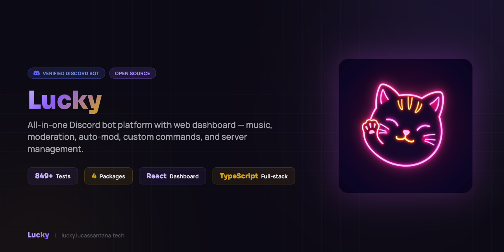

<p align="center">
  
</p>

<p align="center">
  <b>Self-hosted Discord music bot + React dashboard.</b><br>
  TypeScript monorepo · Discord.js 14 · Prisma 7 · ~2500 tests · Zero prod incidents.
</p>

<p align="center">
  <a href="https://discord.com/oauth2/authorize?client_id=962198089161134131&scope=bot%20applications.commands&permissions=36970496"><b>→ Invite Lucky</b></a> ·
  <a href="https://lucky.lucassantana.tech"><b>Dashboard</b></a> ·
  <a href="./docs/ARCHITECTURE.md">Architecture</a> ·
  <a href="./CHANGELOG.md">Changelog</a> ·
  <a href="https://github.com/LucasSantana-Dev/Lucky/issues">Issues</a>
</p>

<p align="center">
  <a href="https://github.com/LucasSantana-Dev/Lucky/actions/workflows/ci.yml"></a>
  <a href="https://nodejs.org/"></a>
  <a href="https://www.typescriptlang.org/"></a>
  <a href="https://discord.js.org/"></a>
  <a href="LICENSE"></a>
</p>

---

## What is Lucky?

Lucky is a production-grade Discord bot built as a TypeScript monorepo. Music player with autoplay + recommendations, full moderation suite, auto-mod presets, and a React 19 dashboard — all self-hostable via Docker.

**Live at** [lucky.lucassantana.tech](https://lucky.lucassantana.tech) · [Invite to your server](https://discord.com/oauth2/authorize?client_id=962198089161134131&scope=bot%20applications.commands&permissions=36970496)

---

## Features

| Category | Highlights |
|----------|------------|
| **Music** | YouTube + Spotify + SoundCloud, queue management, autoplay with recommendations, lyrics, session save/restore |
| **Moderation** | Warn / mute / kick / ban, case tracking, scheduled digest reports, auto-mod presets |
| **Dashboard** | Discord OAuth, guild management, RBAC, moderation overview, music controls, feature toggles |
| **Engagement** | Leveling system with XP + role rewards, starboard, Last.fm scrobbling |
| **Integrations** | Twitch stream notifications, Sentry monitoring, Cloudflare Tunnel |

---

## Architecture

```
packages/
  shared/    # Shared types, services, Prisma client
  bot/       # Discord.js 14 bot (slash commands, music, moderation)
  backend/   # Express 5 REST API (auth, guild management)
  frontend/  # React 19 dashboard (Tailwind 4, shadcn/ui)
```

**Stack**: Node.js 22 · TypeScript 5.9 · Discord Player 7 · Prisma 7 · Redis · Docker

---

## Quick Start

### Docker (recommended)

```bash
git clone https://github.com/LucasSantana-Dev/Lucky.git
cd Lucky
cp .env.example .env        # Fill in DISCORD_TOKEN, CLIENT_ID, DATABASE_URL
docker compose up -d        # Starts postgres, redis, bot, backend, frontend, nginx
docker compose logs -f bot  # Verify startup
```

### Local

```bash
npm install
npm run build
npm run db:migrate
npm start
```

**Minimum requirements**: Node.js 22, FFmpeg, PostgreSQL, Redis, Discord Bot Token.

---

## Development

```bash
npm run dev:bot         # Bot with hot reload
npm run dev:backend     # Backend with hot reload
npm run dev:frontend    # Vite dev server

npm run verify          # Full pre-PR gate (lint + build + test)
npm run test:all        # All unit/integration tests (~2500 tests)
npm run test:e2e        # Playwright smoke tests
```

---

## Slash Commands

**Music** — `/play` `/pause` `/resume` `/skip` `/stop` `/queue` `/shuffle` `/repeat` `/lyrics` `/autoplay` `/songinfo` `/history` `/session`

**Moderation** — `/warn` `/mute` `/kick` `/ban` `/cases` `/digest`

**Auto-mod** — `/automod` (word filter, link filter, spam detection, presets)

**Engagement** — `/level` `/starboard` `/lastfm`

**Twitch** — `/twitch add` `/twitch remove` `/twitch list`

**General** — `/ping` `/help` `/version` `/download`

---

## Documentation

- [Architecture](docs/ARCHITECTURE.md)
- [CI/CD Pipeline](docs/CI_CD.md)
- [Testing Strategy](docs/TESTING.md)
- [Docker Setup](docs/DOCKER.md)
- [Cloudflare Tunnel](docs/CLOUDFLARE_TUNNEL_SETUP.md)
- [Twitch Integration](docs/TWITCH_SETUP.md)
- [Last.fm Integration](docs/LASTFM_SETUP.md)
- [Environment Variables](.env.example)

---

## Contributing

1. Fork → create a `feature/` or `fix/` branch
2. Follow [conventional commits](https://www.conventionalcommits.org/)
3. Run `npm run verify` before opening a PR
4. Keep functions under 50 lines

---

## License

ISC © [LucasSantana-Dev](https://github.com/LucasSantana-Dev)
