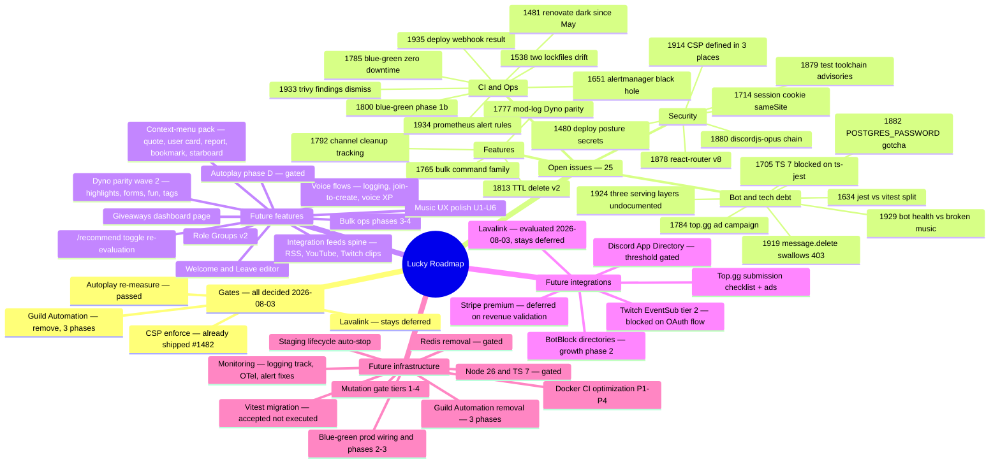
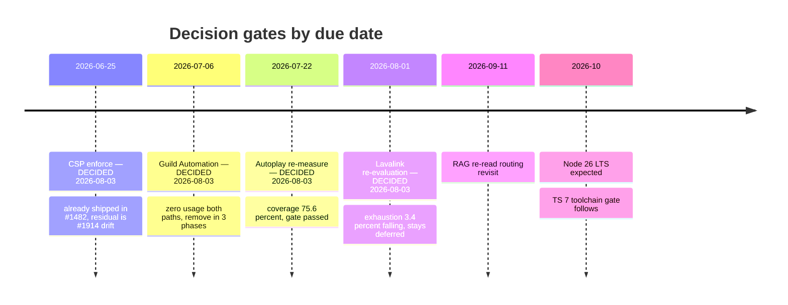

# Roadmap — Lucky

_Refreshed 2026-08-03. Version: v2.39.x. Supersedes the 2026-05-05 (v2.9.0) roadmap._
_Sources: 25 open GitHub issues + full sweep of `decisions/` and `.claude/plans/`, verified unshipped against the codebase. Spec: `.claude/plans/spec-visual-roadmap.md`._

## Visual map

## Decision gates by due date

All four overdue gates were resolved on 2026-08-03 — CSP: already shipped (#1482); Guild Automation: removal (`decisions/2026-08-03-guild-automation-remove.md`); autoplay: passed (`decisions/2026-08-03-autoplay-remeasure-gate-passed.md`); Lavalink: stays deferred (`decisions/2026-08-03-lavalink-reeval-stays-deferred.md`).

## Open issues (25)

### Features

| # | Title | Labels |
|---|-------|--------|
| [#1777](https://github.com/LucasSantana-Dev/Lucky/issues/1777) | mod-log/server-log parity with Dyno (event coverage + per-event routing + ignore lists) | cat:feature, ready-for-agent |
| [#1765](https://github.com/LucasSantana-Dev/Lucky/issues/1765) | generalize bulk actions into a /bulk-* command family | ready-for-agent |
| [#1813](https://github.com/LucasSantana-Dev/Lucky/issues/1813) | TTL delete mode (v2) — deferred from #1687 | ready-for-agent |
| [#1792](https://github.com/LucasSantana-Dev/Lucky/issues/1792) | channel cleanup: track/disable configs after repeated purge failures | ready-for-human |

### CI / Ops

| # | Title | Labels |
|---|-------|--------|
| [#1785](https://github.com/LucasSantana-Dev/Lucky/issues/1785) | blue/green zero-downtime deploys — true B/G for web tier, fast-rollover for the bot | ready-for-agent |
| [#1800](https://github.com/LucasSantana-Dev/Lucky/issues/1800) | blue/green web tier Phase 1b — cold-start wiring + live staging validation | ready-for-agent |
| [#1651](https://github.com/LucasSantana-Dev/Lucky/issues/1651) | LuckyBotDown fired 4.5h, alertmanager never dispatched — silent alert black hole | ready-for-human |
| [#1481](https://github.com/LucasSantana-Dev/Lucky/issues/1481) | Renovate not running since Dependabot→Renovate migration — dep automation dark since 2026-05-27 | ready-for-human |
| [#1935](https://github.com/LucasSantana-Dev/Lucky/issues/1935) | report explicit rollout/rollback result from the homelab deploy webhook | ready-for-human, cat:ci |
| [#1934](https://github.com/LucasSantana-Dev/Lucky/issues/1934) | apply calibrated memory alert rules to the live homelab prometheus | ready-for-human, cat:ci |
| [#1933](https://github.com/LucasSantana-Dev/Lucky/issues/1933) | dismiss the 39 stale Trivy secret findings from the vendored yt-dlp scan | ready-for-agent, cat:ci |
| [#1538](https://github.com/LucasSantana-Dev/Lucky/issues/1538) | repo carries two lockfiles (package-lock + pnpm-lock) that drift independently | ready-for-human |

### Security

| # | Title | Labels |
|---|-------|--------|
| [#1480](https://github.com/LucasSantana-Dev/Lucky/issues/1480) | deploy posture — orphaned high-priv secrets + unscoped secrets + no Production env policy | cat:security, ready-for-human |
| [#1880](https://github.com/LucasSantana-Dev/Lucky/issues/1880) | @discordjs/opus pulls an unfixable node-pre-gyp chain | dependencies, cat:security |
| [#1878](https://github.com/LucasSantana-Dev/Lucky/issues/1878) | migrate to react-router v8 to clear GHSA-qwww-vcr4-c8h2 | dependencies, cat:security |
| [#1879](https://github.com/LucasSantana-Dev/Lucky/issues/1879) | modernise dev test toolchain to clear brace-expansion advisory chain | dependencies, cat:tech-debt |
| [#1914](https://github.com/LucasSantana-Dev/Lucky/issues/1914) | CSP is defined in three places and has drifted | infra, cat:tech-debt |
| [#1714](https://github.com/LucasSantana-Dev/Lucky/issues/1714) | session cookie sameSite=none in production may be stricter than needed | ready-for-agent |

### Bot / tech debt / docs

| # | Title | Labels |
|---|-------|--------|
| [#1929](https://github.com/LucasSantana-Dev/Lucky/issues/1929) | observability: bot reports healthy while music is completely broken | bot, music, needs-triage |
| [#1919](https://github.com/LucasSantana-Dev/Lucky/issues/1919) | message.delete() swallows permission errors as if they were 404s | bot, moderation, cat:bug |
| [#1634](https://github.com/LucasSantana-Dev/Lucky/issues/1634) | test runner fragmentation — Jest vs Vitest across monorepo packages | cat:tech-debt |
| [#1705](https://github.com/LucasSantana-Dev/Lucky/issues/1705) | TypeScript 7 migration blocked: ts-jest has no TS7-compatible release | needs-info |
| [#1924](https://github.com/LucasSantana-Dev/Lucky/issues/1924) | record which layer serves which host (three serving layers, undocumented) | infra, cat:docs |
| [#1882](https://github.com/LucasSantana-Dev/Lucky/issues/1882) | changing POSTGRES_PASSWORD in .env after first boot silently does nothing | cat:tech-debt, cat:docs |
| [#1784](https://github.com/LucasSantana-Dev/Lucky/issues/1784) | launch $10 Top.gg ad campaign once listing passes verification (blocked ~1-2wk) | ready-for-human |

## Future features

Verified unshipped against the codebase on 2026-08-03.

- **Context-menu pack** — Quote-as-embed, User card (mod history + level), Report message→mod case, Bookmark (new table), Pin-to-starboard. Wave 1: Quote → User card → Report. Source: `.claude/plans/2026-06-23-bot-flows-backlog-design.md`, tiering in `decisions/2026-06-21-context-menu-adoption-strategy.md`.
- **Welcome/Leave dedicated editor** — `WelcomeLeaveEditor.tsx` with embed/plaintext toggle, token picker, live preview. Called "cheapest high-value win in the whole backlog." Source: `.claude/plans/2026-06-23-bot-flows-backlog-design.md`.
- **Giveaways dashboard page** — bot side (models + scheduler) shipped; dashboard CRUD + `managementGiveaways` routes never landed. Source: same design doc.
- **Integration feeds spine** — `FeedSubscription` model, generic poller/embed/control services; RSS first → YouTube (WebSub) → Twitch clips (Helix); `IntegrationFeeds.tsx`. ~5 weeks, highest growth value. Source: same design doc.
- **Voice flows (greenfield)** — `voiceStateHandler.ts` fan-out: voice logging, Join-to-Create temp channels, Voice XP with anti-AFK. Source: same design doc.
- **Dyno-parity wave 2** — keyword highlights (DM watch), Forms (modal → submission channel), fun pack (8ball/coin/dice), member tags. Source: `.claude/plans/2026-07-03-dyno-loss-features.md`.
- **Bulk ops phases 3–4** — bulk-ban/warn/assign-role/remove-role/lockdown/slowmode, then bulk-mute/purge-advanced/seed-reaction-roles/unban. Executor infra ~90% present. Source: `.claude/plans/2026-06-23-batch-commands-design.md`, `decisions/2026-06-23-batch-operations-bullmq.md`. Tracked partly by #1765.
- **Role Groups v2** — exclusivity/pick-one groups, multi-message groups, bot slash command, select-menu UI, full IdempotencyKey state machine. Source: `.claude/plans/2026-06-23-role-groups-design.md`.
- **Music UX polish** — U1–U6 (queue position in /nowplaying, vote-skip progress, /queue header, /history autoplay-reason, /songinfo audio features, seed feedback) + elapsed-time progress, `recommendationReason` threading, PlaybackControls loading states, SSE staleness indicator. (streamBridge fallback surfacing shipped in v2.39.0, #1920.) Source: `.claude/plans/music-feature-backlog.md`, `.claude/plans/2026-07-10-feature-mapping-research.md`.
- **`/recommend` re-evaluation** — `MUSIC_RECOMMENDATIONS` toggle still OFF; its gate (Phase B outcome writes) has since shipped, so the enable decision is due. Source: `decisions/2026-05-21-autoplay-recommendation-roadmap.md`.
- **Autoplay Phase D (ML personalization)** — still DEFERRED. Coverage prerequisite met (75.6% window), but the 2026-06-24 gate's acceptance trigger (per-source <85%) did NOT fire: 0.926–0.970. The system does not need it. Source: `decisions/2026-08-03-autoplay-remeasure-gate-passed.md`.
- **Skip-reason feedback UX redesign** — pipeline works but adoption is ~zero (2 rows lifetime). Needs redesign, not a fix; new separate decision. Source: `decisions/2026-08-03-autoplay-remeasure-gate-passed.md`.
- **Mood clustering #1095** — on hold pending read-only spike (needs prod access). Source: `decisions/2026-06-14-autoplay-mood-clustering-1095-hold.md`.
- **VC multi-user taste blend** — likely the surviving chunk of the stale taste-blend plan; needs re-triage. Source: `.claude/plans/autoplay-taste-blend.md` (2026-04-11, stale).
- **Reaction-roles dashboard follow-ups** — delete Discord message on dashboard delete; edit existing reaction-role message. Source: `decisions/2026-06-22-reaction-roles-dashboard-create.md`.
- **Move-message extensions** — slash-command variant, mod-log archival, web UI. Source: `.claude/plans/move-message.md`.
- **In-bot growth (deferred)** — `/share` cards, vote perks; revisit if external channels stall. Source: `decisions/2026-06-18-in-bot-growth.md`.
- **i18n residual cleanup** — per-page/config translation coverage. Source: `.claude/plans/i18n-language-switcher.md`.

## Future integrations

- **Twitch EventSub Tier 2** — subscribe/gift/message, follow v2, cheer. **Blocked: needs broadcaster-scoped OAuth flow (new ADR + PR).** Source: `decisions/2026-06-22-twitch-eventsub-tier1-expansion.md`.
- **Stripe premium tiers** — toggle placeholder + staged schema exist; deferred pending Phase 2 revenue validation. Note tension: README markets "no paywall, no premium tier." Source: `.claude/plans/backlog-2026-05-04.md` §J.
- **Lavalink + youtube-source migration** — re-evaluated 2026-08-03: gate NOT fired (3.4% exhaustion, falling trend, no velocity cluster). Stays deferred with trigger-based revisit. Source: `decisions/2026-08-03-lavalink-reeval-stays-deferred.md`.
- **YouTube po_token / cookies-from-browser** — data-gated escalation if a 403/velocity cluster appears. Source: same ADR.
- **Top.gg completion** — submission checklist (support server, banner, webhook token) + ad campaign #1784. Source: `docs/TOP_GG_SUBMISSION.md`.
- **BotBlock multi-directory sync** — growth Phase 2; dry-run on 2–3 directories first. Source: `decisions/2026-06-17-growth-channel-sequencing.md`.
- **Discord App Directory** — growth Phase 3; gated on verification threshold (~100+ servers / 10K users). Source: same ADR.
- **Spotify Extended Quota / Last.fm-all-in for Discover** — conditional on Spotify 429 rate >5–10%. Source: `decisions/2026-06-01-musical-taste-discover-performance.md`.

## Future infrastructure

### Deploy / CI

- **Blue/green Phase 1b prod wiring** — works on staging; prod cutover deferred for operator sign-off. Phase 2 (bot post-deploy health-gate), Phase 3 (destructive-migration CI check) deferred. Tracked by #1800, #1785. Source: `decisions/2026-07-11-bluegreen-web-tier.md`.
- **Music queue persist+restore across deploys** — pilot gate: first instrument "was music playing at SIGTERM" logging. Source: `decisions/2026-07-11-bot-redeploy-no-bluegreen.md`.
- **Docker CI optimization P1–P4** — baselined (cold 443s, cache 101% over limit), not started: provenance/sbom off, kill double opus compile, cache mode=max→min (required), pre-built base image (gated). Source: `.claude/plans/2026-07-12-docker-ci-optimization.md`.
- **CI follow-ups** — unify docker matrices; `workflow_run` chain replacing image-wait poll; AI-reviewer consolidation (3 reviewers/PR, parked as product decision). Source: `decisions/2026-07-27-ci-workflow-efficiency.md`.
- **Shared-build artifact cache across CI jobs** — sanctioned, deliberately waiting for a concrete CI-time complaint. Source: `decisions/2026-07-12-moonrepo-adoption-deferred.md`.
- **Frontend stale-image detection** — build-version marker in served HTML. Source: `decisions/2026-06-24-deploy-frontend-health-gate.md`.
- **Idempotent-migrations CI gate** — full-chain apply + partial-state replay on Postgres 18. Tracked as #1837. Source: `decisions/2026-07-16-idempotent-migrations.md`.
- **Node 26 / TypeScript 7** — gated (Node 26 LTS ~Oct 2026; TS 7.1 + ecosystem support). Related: #1705. Source: `decisions/2026-07-12-toolchain-modernization-node-ts.md`.

### Monitoring / observability

- **Alert black hole fix** — #1651 (alertmanager never dispatched; Discord channel shares failure domain with bot).
- **Broker-failure instrumentation** — metric/Sentry breadcrumb on Redis pub/sub publish failure. Source: `decisions/2026-06-13-message-broker-rabbitmq-kafka.md`.
- **Logging-quality track** — structured JSON, bot correlation IDs, audit of ~60 silent `.catch` swallows, pino/OTel; activates on next log-quality-slowed incident. Source: `decisions/2026-07-01-bot-monitoring-dead-man-first.md`.
- **OpenTelemetry tracing** — deferred; Sentry-native (~$26/mo) is the fast path if accepted. Source: `decisions/2026-05-31-tracing-defer-reaffirmed.md`.
- **Failure-mode metrics** — 429/timeout/slow-query counters; promote to P1 if a >2h diagnosis mystery occurs. Source: `decisions/2026-05-30-observability-remediation-strategy.md`.
- **Manual monitoring wiring** — Sentry release/source maps, off-box heartbeat, Grafana alert rules + Discord contact point. Source: `monitoring/README.md`.

### Security / testing

- **CSP consolidation (#1914)** — the enforce flip already shipped (#1482); residual work is the drift: policy defined in 3 places (backend helmet, nginx, vercel.json), plus the `style-src 'unsafe-inline'` drop re-check. Source: `.claude/plans/2026-06-11-security-headers-1283.md`.
- **Vitest migration** — accepted, not executed (bot/shared/backend still Jest); Stryker runner swap included. Tracked by #1634. Source: `decisions/2026-06-27-standardize-test-runner-vitest.md`.
- **Backend mutation-gate tiers 1–4** — pilot on `requestId.ts`, break 90→82, then expand; promotion to required check is a separate decision. Source: `decisions/2026-06-16-backend-mutation-gate-rollout.md`.
- **#1378 ESLint typing tail** — 136 violations (86 non-null-assertion, 50 no-unsafe-*); 6-phase plan to warn→error. Source: `.claude/plans/2026-06-13-1378-typing-tail.md`.

### Platform / data

- **Guild Automation removal (decided 2026-08-03, execution pending)** — zero usage on both paths (2 runs ever, latest 2026-05-01). Remove in 3 phases: web+backend → bot+shared core → schema drop. ~4,900 LOC leaves the tree. Source: `decisions/2026-08-03-guild-automation-remove.md`.
- **Staging lifecycle** — auto-stop after N idle days, fold staging bot in, Docker image prune policy, logrotate. Source: `decisions/2026-07-02-resource-hygiene-alert-calibration-first.md`, `decisions/2026-07-03-staging-test-bot.md`.
- **Full Redis removal** — pub/sub → Postgres LISTEN/NOTIFY; separate gated decision. Source: `decisions/2026-05-31-redis-scope-reduction.md`.
- **`channelId` + time-bucket on `recommendations`** — schema work in the Phase-D prerequisite path.

### Tech debt / refactors pending

- **Frontend god-components** — `AutoMod.tsx` (~984 LOC), `ServerSettings.tsx` (~914), `Sidebar.tsx` split. Recurring across 4 backlogs, never executed. Source: `.claude/plans/backlog-2026-05-04.md`.
- **`bot/utils/` structural refactor + DI container** — "document but don't ship yet." Source: `.claude/plans/lucky-refactor-map.md`.
- **Music subsystem event-emitter unification** — typed `EventEmitter<MusicEvents>`. Source: `.claude/plans/backlog-2026-05-04.md` B5.
- **Music structural items** — `replenisher.ts` split, `candidateScorer.ts` slim, `searchQueryCleaner` spec, watchdog/snapshot metrics. Source: `.claude/plans/music-feature-backlog.md` (stale, post-v3).
- **`COMMAND_CATEGORIES` unification** — needs product/i18n decision. Source: `decisions/2026-06-04-redundancy-consolidation.md`.
- **`CandidateAggregator` seam** — prerequisite (Guild Automation decommission) has fired; eligible for revisit. Source: `decisions/2026-05-24-candidate-aggregator-deferred.md`.
- **Legacy `MusicRecommendationService` cleanup** — documented dead code. Source: `decisions/2026-06-10-defer-autoplay-engine-extraction.md`.

## Explicit non-goals (do not re-propose)

- Apple Music / YouTube Music taste integration — `.claude/plans/autoplay-taste-blend.md` out-of-scope.
- RabbitMQ/Kafka/NATS — keep Redis pub/sub; revisit only on multi-instance or durable-history needs (`decisions/2026-06-13-message-broker-rabbitmq-kafka.md`).
- Blue/green for the bot process — ruled out (`decisions/2026-07-11-bot-redeploy-no-bluegreen.md`); fast-rollover + queue-restore pilot instead.
- Moonrepo/turbo — deferred with thresholds (`decisions/2026-07-12-moonrepo-adoption-deferred.md`).

## Recently shipped (context)

- v2.38–v2.39: blue/green web tier on staging, release-please, dependabot reactivation, SENTRY_RELEASE wiring, idempotent migrations.
- Dyno-parity wave 1: reminders, AFK, channel cleanup, giveaways persistence; tickets; move-message context menu.
- Spotify OAuth + taste integration; autoplay Phase C baseline; recommendation outcome writes (#1275).
- Twitch EventSub Tier 1; reaction-roles dashboard create/delete; Role Groups v1; bulk-move-messages + bulk-kick.
